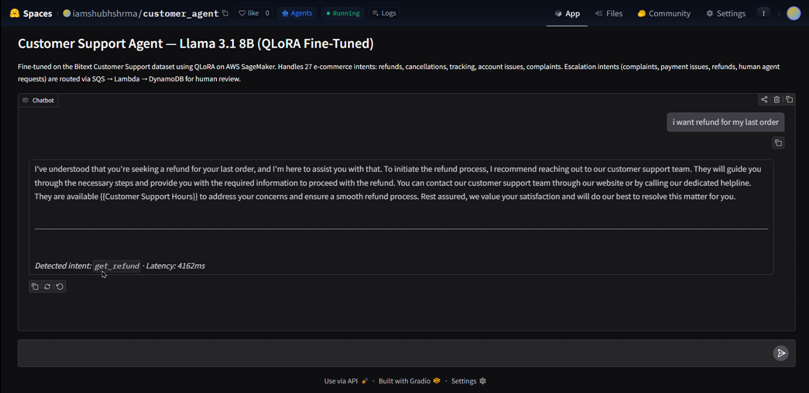
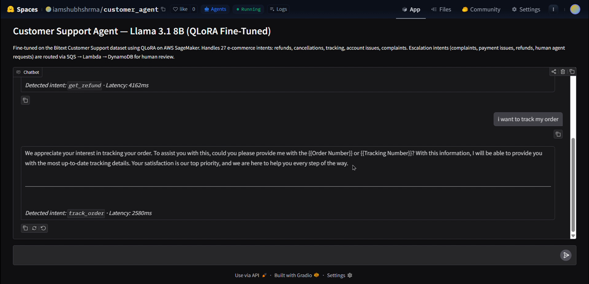
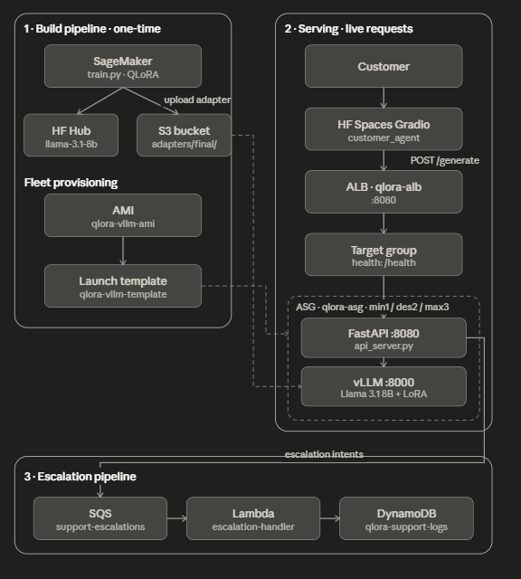

# QLoRA Customer Support Chatbot

End-to-end fine-tuning and production deployment of **Llama 3.1 8B Instruct** as a customer support agent — fine-tuned on AWS SageMaker with QLoRA, served via vLLM + FastAPI behind an Application Load Balancer with Auto Scaling, and wired to a real-time escalation pipeline (SQS → Lambda → DynamoDB) that routes complaints, refunds, and payment issues to a human queue.

- **Live demo:** [iamshubhshrma/customer_agent on HF Spaces](https://huggingface.co/spaces/iamshubhshrma/customer_agent)
- **Adapter weights:** [iamshubhshrma/llama-3.1-8b-customer-support on HF Hub](https://huggingface.co/iamshubhshrma/llama-3.1-8b-customer-support)
- **Dataset:** [bitext/Bitext-customer-support-llm-chatbot-training-dataset](https://huggingface.co/datasets/bitext/Bitext-customer-support-llm-chatbot-training-dataset)





---

## Architecture



Three flows make up the system:

1. **Training** (one-time, SageMaker) — `train.py` runs QLoRA fine-tuning on `ml.g5.2xlarge`; the adapter is uploaded to S3 and pushed to HF Hub.
2. **Request path** — Customer → Gradio (HF Spaces) → ALB `qlora-alb:8080` → Target Group `qlora-tg` → a FastAPI instance in ASG `qlora-asg` → vLLM (Llama 3.1 8B + `support-bot` LoRA).
3. **Escalation path** — FastAPI keyword-detects intent. Escalation intents (`complaint`, `payment_issue`, `get_refund`, `contact_human_agent`, `get_human_agent`, `check_cancellation_fee`) are published to SQS `qlora-support-escalations` → consumed by Lambda `qlora-escalation-handler` → written to DynamoDB `qlora-support-logs` for human follow-up.

---

## Results

| Metric | Value |
|--------|-------|
| Base model | `meta-llama/Llama-3.1-8B-Instruct` |
| Train loss (final) | **0.5586** |
| Eval loss | **0.4950** |
| Eval token accuracy | **83.2%** |
| Training time | **4.4 hours** on a single A10G (24 GB) |
| Peak training VRAM | ~18–20 GB |
| Trainable params | ~0.75% of total |
| Adapter size | ~110 MB |

To regenerate ROUGE-L and intent-accuracy numbers on the 200-sample held-out set:

```bash
python evaluate.py outputs/final
```

---

## Quick start

### Training, evaluation, and local inference

```bash
pip install -r requirements.txt
python data/prepare.py   # verify dataset loads
python train.py          # 8B needs ~24 GB VRAM (use ml.g5.2xlarge)
python evaluate.py       # ROUGE-L + intent accuracy on 200-sample holdout
python infer.py          # interactive CLI against the saved adapter
```

### Serving (EC2 inference instance)

```bash
sudo apt-get install -y ninja-build      # required for FlashInfer JIT
pip install -r requirements-serve.txt
python api_server.py                     # FastAPI on :8080, vLLM on :8000
```

Full production pipeline : (SageMaker training → S3/HF Hub push → EC2 vLLM + FastAPI → SQS + Lambda + DynamoDB → ALB + ASG → HF Spaces)


---

## Configuration

All hyperparameters live in one file: [`config/qlora_config.py`](config/qlora_config.py).

| Hyperparameter | Value |
|----------------|-------|
| Quantization | 4-bit NF4, double quant (BitsAndBytes) |
| LoRA rank / alpha | 16 / 32 |
| Target modules | `q_proj`, `k_proj`, `v_proj`, `o_proj`, `gate_proj`, `up_proj`, `down_proj` |
| Effective batch size | 8 (2 × grad_accum 4) |
| Learning rate | 2e-4, cosine schedule, 3% warmup |
| Epochs | 1 |
| Max sequence length | 512 |
| Packing | Disabled (avoids cross-contamination without flash_attn) |
| Optimizer | `paged_adamw_32bit` |
| Mixed precision | bf16 on Ampere+, fp16 on T4 (auto-detected) |
| Experiment tracking | MLflow |

---

## Prompt format

The training script uses the Llama 3 Instruct chat template:

```
<|begin_of_text|><|start_header_id|>system<|end_header_id|>
You are a helpful customer support agent. Answer the customer's question clearly and politely.
<|eot_id|><|start_header_id|>user<|end_header_id|>
{customer message}
<|eot_id|><|start_header_id|>assistant<|end_header_id|>
{agent response}
<|eot_id|>
```

---

## Repository layout

```
.
├── README.md              # this file
├── infrastructure.json    # CloudFormation template for the whole stack
├── train.py               # SFT training entrypoint
├── evaluate.py            # ROUGE-L + intent accuracy on 200-sample holdout
├── infer.py               # interactive CLI
├── api_server.py          # FastAPI + vLLM + SQS escalation
├── notebook.ipynb         # Colab/Kaggle artifact (mirrors train.py)
├── config/qlora_config.py # all hyperparameters
├── data/prepare.py        # Bitext load + chat template + splits
└── results/eval_results.json
```

---

## AWS stack

| Component | Resource |
|-----------|----------|
| Training | SageMaker Studio · `ml.g5.2xlarge` (1× A10G) |
| Adapter storage | S3 · `iamshubhshrma-customeragent/adapters/final/` |
| Inference fleet | Auto Scaling Group `qlora-asg` (1/2/3) of `g5.2xlarge` from custom AMI `qlora-vllm-ami` |
| Load balancing | Application Load Balancer `qlora-alb` :8080 → Target Group `qlora-tg` (`/health`) |
| Inference server | vLLM 0.21 (continuous batching, LoRA hot-load) + FastAPI |
| Escalation queue | SQS `qlora-support-escalations` |
| Escalation consumer | Lambda `qlora-escalation-handler` (Python 3.12) |
| Escalation store | DynamoDB `qlora-support-logs` (PK: `request_id`) |
| Public demo | Hugging Face Spaces (Gradio) calling the ALB endpoint |

Total one-time cost to build: **< $10** (SageMaker training ~$7 + EC2 demo ~$3).

---

## Roadmap

| Version | Status |
|---------|--------|
| v1.0 — QLoRA SFT on 3B, adapter on HF Hub | Done |
| v1.1 — 8B upgrade, SageMaker training, vLLM API on EC2 | Done |
| v1.2 — SQS escalation pipeline + Lambda → DynamoDB | Done |
| v1.3 — ALB + ASG fleet, Gradio demo on HF Spaces | Done |

---
